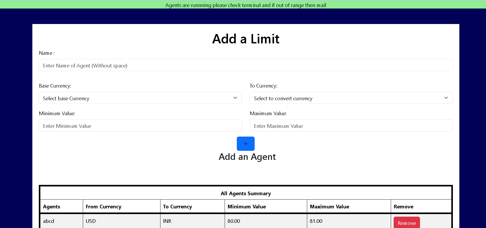
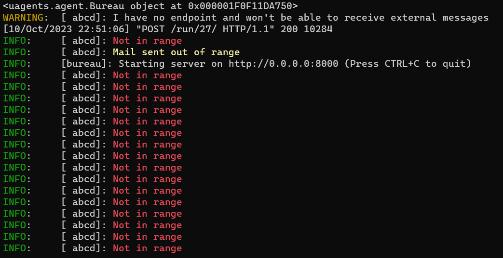

# Currency Notify

The Currency Exchange Monitor & Alert Agent is a powerful tool designed to provide users with real-time updates on currency exchange rates. This project leverages the uAgent library to offer a seamless and intuitive experience for monitoring multiple foreign currencies relative to a chosen base currency.

## Features
1. Base Currency Selection: Users can choose their preferred base currency, from which exchange rates will be calculated.

2. Monitor Multiple Currencies: Users have the flexibility to monitor one or more foreign currencies of their choice alongside the base currency.

3. Real-time Exchange Rates: The system is integrated with a currency exchange  called  [RAPID API](https://www.example.com) to fetch up-to-date exchange rates.

4. Threshold Alerts: Users can set custom thresholds for alerts using [uagents](https://github.com/fetchai/uAgents).  For instance, they can choose to be notified if 1 USD exceeds 82.60 INR or falls below 82.55 EUR.

5. Alert Notifications: The system automatically sends alerts to the user when exchange rates cross the predefined thresholds both through the terminal red for out of range and blue for in range and also through their email.

6. Storage of Uagents: Each user can make his own custom **uagents** specifying the name and threshold values and each time the user logins the all_agent.py file is written where all are executed using the **Bureau**.
## Installation

1. Clone the repository.
    ```bash
    git clone https://github.com/Anuraag001/amazon_hackon_r1.git


3. Create and activate a virtual environment(for example to create a virtual environoment named hackon).
   ```bash
   python -m venv hackon
   
  
4. Install project dependencies using [Poetry](https://python-poetry.org/docs/)
   ```bash
   pip install poetry
   poetry install
  
   
5. Configure environment variables in a `.env` file.
   
6. Apply database migrations with
   ```bash
   python manage.py migrate

   
7. Run the development server with
   ```bash
   python manage.py runserver


## Usage

- Access the project at `http://localhost:8000/`.
- Admin panel: `http://localhost:8000/admin/`.
- view all uagent messages on terminal and get a mail if not in range after clicking the **Run** button on agents page in the website

## Configuration

- Set the following environment variables in your `.env` file:
  - `SECRET_KEY`
  - `DEBUG`

## Contributing

We welcome contributions! 

## Just to show some examples of uagents working when the limit set by the user is crossed

Image showing the alert sent to your mail when an agent detects that the limits are crossed.




Alerts showing up in the terminal




## Credits

- Uagents: https://fetch.ai/docs
- Django: https://www.djangoproject.com/
- poetry: https://python-poetry.org/docs/
- Rapid API: https://rapidapi.com/hub

## Contact

For questions or feedback, please contact 
- [Anuraag](mailto:anuraagbv1@gmail.com)
- [Syed Ameen](mailto:bangaloreameen@gmail.com)
- [Pranetha](mailto:pranethacoding@gmail.com)
